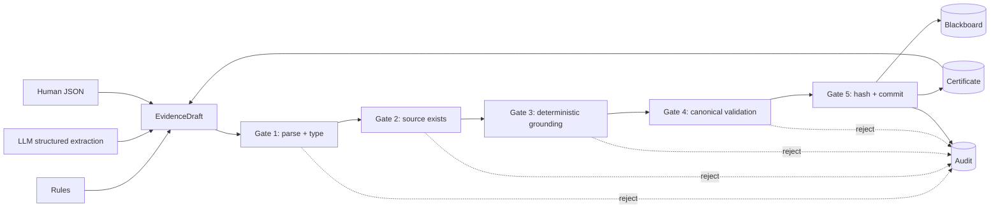

# Grounding Firewall

Grounding Firewall is a reference implementation of a commit protocol for generated
knowledge.

It is not an extractor, a relation parser, a RAG stack, or a better NLP pipeline. It is the
runtime boundary after those systems emit proposals.

> NLP proposes. Transactional Cognition commits.

Project page: <https://nikitph.github.io/semanticFirewall/>

## Core Claim

Probabilistic systems may generate semantic proposals, but only deterministic runtime gates may
commit evidence into persistent memory.

The central invariant is:

```text
For every committed EvidenceSupport:
raw_chunk_text[start_index:end_index] == span_ref.quote
```

In other words, no support can enter the blackboard unless every quoted span is mechanically
grounded in the referenced source chunk.

## What This Repository Demonstrates

- LLM, NLP, rule-based, and human-style proposal sources can all emit the same `EvidenceDraft`
  shape.
- The runtime applies the same parse, source-reference, grounding, canonicalization, hashing,
  audit, and provenance contract to every proposal source.
- Rejected proposals leave structured audit traces.
- Every proposal attempt emits a Transition Admissibility Certificate with pre/post state hashes,
  proposal hash, gate results, and committed IDs when applicable.
- Repeated valid proposals are idempotent for blackboard state while still appending audit events.
- Provenance can be queried from committed claim back to exact raw spans.

## Architecture



The extractor is not the architecture. The commit protocol is the architecture.

## Runtime Contract

Any proposal generator may emit draft JSON. The runtime guarantees:

1. The draft is parsed and typed before use.
2. The source chunk exists.
3. Every quoted span is deterministically grounded in that source chunk.
4. Canonical identity is validated before hashing.
5. Claim and support commits are idempotent.
6. Every proposal attempt is audited.
7. Provenance is queryable after commit.
8. Every transition emits a certificate linking proposal hash, gate results, pre-state hash,
   post-state hash, and committed IDs.

## Results

### Grounding Firewall Experiment

| case | outcome |
| --- | --- |
| valid exact quote | committed |
| valid whitespace normalization | committed |
| valid smart punctuation normalization | committed |
| valid ellipsis quote | committed |
| phantom chunk ID | Gate 2 rejected |
| hallucinated quote | Gate 3 rejected |

Invariant check:

```text
For all supports, raw chunk substring equals SpanRef.quote: True
```

### Adapter Harness

The adapter harness routes heterogeneous proposal generators through the same runtime.

| generator | proposals | committed | rejected Gate 1 | rejected Gate 2 | rejected Gate 3 | duplicate supports |
| --- | ---: | ---: | ---: | ---: | ---: | ---: |
| HumanProposalGenerator | 4 | 4 | 0 | 0 | 0 | 0 |
| RuleProposalGenerator | 4 | 4 | 0 | 0 | 0 | 0 |
| LLMStructuredProposalGenerator | 6 | 3 | 1 | 1 | 1 | 1 |
| OpenIEProposalGenerator | 4 | 3 | 0 | 0 | 1 | 0 |

The important result is not that one extractor wins. The important result is that every extractor
is made governable by the same commit protocol.

The current harness emits 18 proposal attempts, 18 audit events, and 18 transition certificates.

## API

### Ingest Chunks

```bash
curl -X POST http://127.0.0.1:8000/ingest \
  -H 'Content-Type: application/json' \
  -d '{"chunks":[{"chunk_id":"chunk-1","text":"Net revenue was $4M in FY2024."}]}'
```

### Propose Evidence

```bash
curl -X POST http://127.0.0.1:8000/propose \
  -H 'Content-Type: application/json' \
  -d '{"draft_json":"{\"content\":\"Net revenue was $4M in FY2024.\",\"source_chunk_id\":\"chunk-1\",\"quoted_spans\":[\"Net revenue was $4M in FY2024\"]}"}'
```

### Query Graph

```bash
curl http://127.0.0.1:8000/graph
```

### Query Claim Provenance

```bash
curl http://127.0.0.1:8000/claims/<claim_id>/provenance
```

### Query Transition Certificates

```bash
curl http://127.0.0.1:8000/certificates
```

## Install

Python 3.11+ is required.

```bash
python3 -m venv .venv
source .venv/bin/activate
pip install -e ".[dev]"
```

## Run

```bash
uvicorn app.main:app --reload
```

By default, SQLite data is stored in `./grounding_firewall.db`. Override it with:

```bash
export GROUNDING_FIREWALL_DB_PATH=/path/to/grounding_firewall.db
```

## Test

```bash
pytest
ruff check .
```

## Experiments

```bash
python experiments/run_experiments.py
python experiments/run_canonicalization_eval.py
python experiments/run_adapter_harness.py
```

Generated reports:

- [Grounding report](experiments/report.md)
- [Canonicalization report](experiments/canonicalization_report.md)
- [Adapter harness report](experiments/adapter_harness_report.md)

## Repository Structure

```text
app/
  adapter_harness.py     # Proposal generator metrics runner
  proposals.py           # ProposalGenerator protocol and example adapters
  grounding.py           # Deterministic quote grounding
  pipeline.py            # Five-gate commit boundary
  storage.py             # SQLite blackboard, audit log, and certificates
  main.py                # FastAPI service
experiments/
  run_experiments.py
  run_canonicalization_eval.py
  run_adapter_harness.py
tests/
  test_adversarial_grounding.py
  test_adapter_harness.py
  ...
docs/
  index.html             # GitHub Pages site
```

## Scope Boundary

This project deliberately does not optimize extraction quality. Better NER, OpenIE, relation
extraction, ontology alignment, and canonicalization are valuable but separate concerns.

The artifact here is the governed lifecycle:

```text
untrusted proposal -> deterministic gates -> committed support or audited rejection
```

## License

MIT
